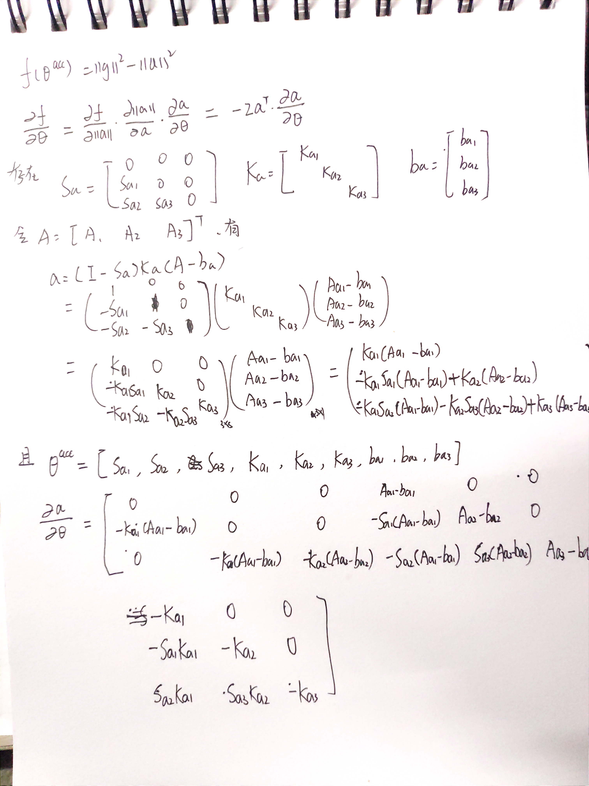
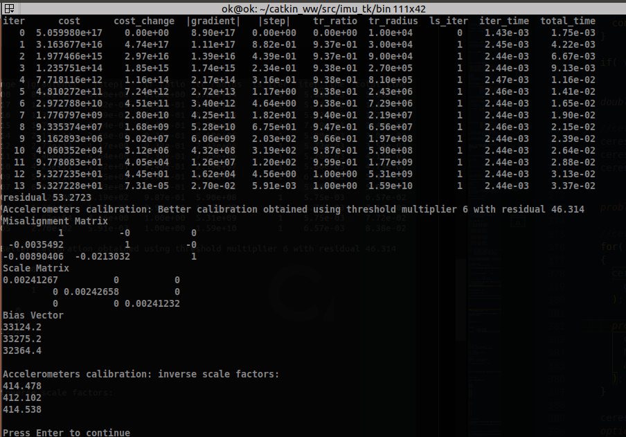
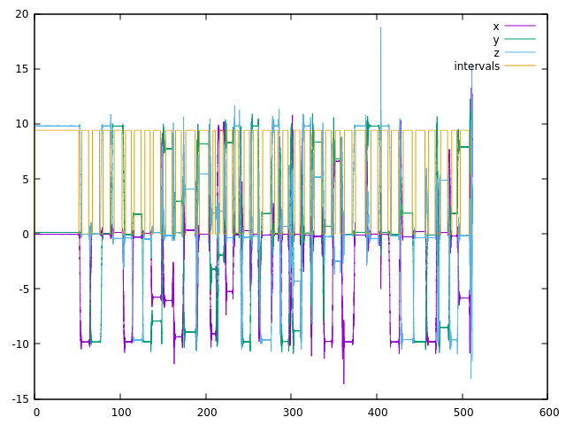

# bulinx-C5-imu_cali

ubuntu 18.04 melodic 参考[here](src/imu_tk/README.md), 自行完成环境配置

---

## 推导加速度计对应残差对加速度内参的雅可比
公式推导按照a=(I-Sa)Ka(A-ba),代码中按照公式min_mat展开，符号相对应，结构大同小异。

---

## 改加速度计内参模型为下三角，构建ceres解析式求导，仿真数据做验证

创造CaliAccCostFunction类，继承自SizedCostFunction [here](https://github.com/bulinx/bulinx-c5-imu-calib/blob/5dd769b4a3365d803fe29fe37229cf29701ef021/src/imu_tk/src/calibration.cpp#L118)

下三角模型修改处：

[chang1](https://github.com/bulinx/bulinx-c5-imu-calib/blob/5dd769b4a3365d803fe29fe37229cf29701ef021/src/imu_tk/src/calibration.cpp#L142)

[chang2](https://github.com/bulinx/bulinx-c5-imu-calib/blob/5dd769b4a3365d803fe29fe37229cf29701ef021/src/imu_tk/src/calibration.cpp#L326)

[chang3](https://github.com/bulinx/bulinx-c5-imu-calib/blob/5dd769b4a3365d803fe29fe37229cf29701ef021/src/imu_tk/src/calibration.cpp#L414)

雅克比构建：
[chang4](https://github.com/bulinx/bulinx-c5-imu-calib/blob/5dd769b4a3365d803fe29fe37229cf29701ef021/src/imu_tk/src/calibration.cpp#L181)

ceres解析式修改：
[chang5](https://github.com/bulinx/bulinx-c5-imu-calib/blob/5dd769b4a3365d803fe29fe37229cf29701ef021/src/imu_tk/src/calibration.cpp#L355)

标定结果如下：

